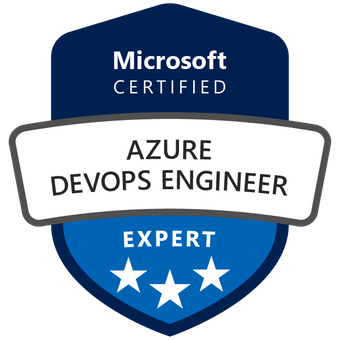

# 👋 Hi, I'm Umesh Teja Nareddy | **Cloud DevOps | SRE | Infrastructure | AI & ML Engineer**  

🚀 **Designing Scalable Cloud Platforms | Automating Everything | Building Intelligent Systems**  

🔹 5+ years in **DevOps, Cloud, and SRE** (AWS, Azure, GCP)  
🔹 Expertise in **Automation, IaC, CI/CD, and Observability**  
🔹 Exploring **MLOps, AIOps, and AI-driven Trading Systems**  
🔹 Passionate about **Algo Trading, High-Frequency Trading (HFT), Knowledge Sharing, and Continuous Learning**  

---

## 🔧 Tech Stack & Tools  

### ☁️ Cloud & Platforms  

  
  
  

### 🔧 DevOps & CI/CD  

  
  
  

### 🚀 IaC & Automation  

  
  
  
  

### 🐳 Containers & Orchestration  

  
  
  
  

### 📊 Monitoring & Observability  

  
  
  
  

### ⚙️ Languages & Scripting  

  
  
  
  

---

## 📜 Certifications  

  <figure>
     
    <figcaption>AWS DevOps Engineer</figcaption>
  </figure>
  <figure>
     
    <figcaption>AWS Solutions Architect</figcaption>
  </figure>
  <figure>
     
    <figcaption>Azure DevOps Engineer Expert</figcaption>
  </figure>
  <figure>
     
    <figcaption>Azure Developer Associate</figcaption>
  </figure>

---

## 🏆 Open Source & Projects  
🔹 Contributed to **DevOps, IaC, and Automation** projects  
🔹 Building **AI-powered trading bots** with Alpaca & IBKR APIs  
🔹 Published **academic research** on **IoT, Big Data, and Generative AI**  

📂 Explore my work here: [GitHub Repositories](https://github.com/UmeshNareddy)  

---

## 📚 Current Focus  

- 🤖 **MLOps:** End-to-end ML model automation  
- 🤖 **AIOps:** Intelligent monitoring & self-healing systems  
- 📊 **Algorithmic Trading:** Cloud-native bots for equities & options  
- ☁️ **Multi-Cloud Solutions:** Scaling across AWS, Azure, and GCP  

---

## 📢 Let's Connect  

💼 **Open to:** Cloud DevOps, SRE, and AI/ML Engineering roles  
🌐 **Portfolio:** [UmeshNareddy.github.io](https://UmeshNareddy.github.io)  
🔗 **LinkedIn:** [linkedin.com/in/umesh-teja-nareddy](https://www.linkedin.com/in/umesh-teja-nareddy/)  
💻 **GitHub:** [github.com/UmeshNareddy](https://github.com/UmeshNareddy)  

🚀 *Follow me on GitHub — let’s innovate together!* 🎯  

---

